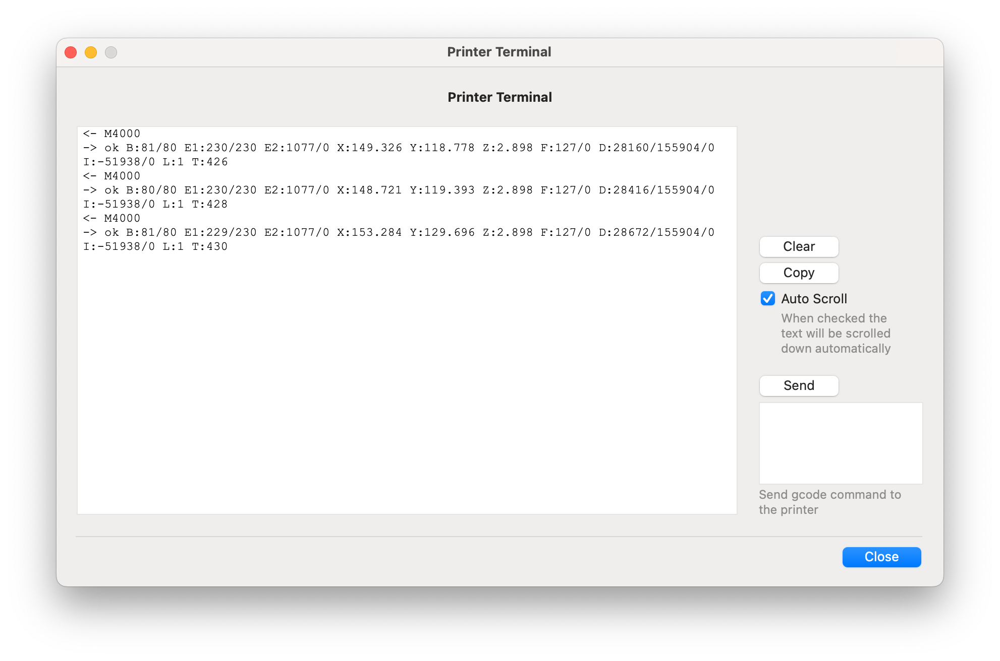

# 3DPrint Connect
Desktop GUI application for macOS designed to enable the sending of 3D printer G-code files from a computer to a printer over the network.


### Preface 

As a result, since I'm using OrcaSlicer, there is no way to work remotely with QIDI legacy printers (X-CF Pro, X-Max, I-Fast). I own the X-CF Pro, and it is a great printer. However, QIDI Tech suddenly stopped supporting the printer. Therefore, I am writing a standalone desktop application from scratch to work with the printer.


### Features

#### Print Job

- File Name
- Progress (Percent)
- Remaining time (minutes)

#### Print Job Actions

- Stop
- Pause/Continue
- Delete

#### Printer Status

- Offline/Online
- Extruder current temperature
- Extruder target temperature
- Bed current temperature
- Bed target temperature
- Extruder Cooler state in percent (0-100)
- Current print file

#### Printer Info

- Name
- Wifi version
- MAC Address
- ID

#### Printer Actions

- Search printer in local network (Broadcast message)
- Print (file name)
- Turn off (You can't turn on back again !)
- LED turn (on/off)
- Beep
- Reboot
- Set extruder temperature **(not implemented)**
- Set bed temperature **(not implemented)**
- Set Extruder cooler/fan value **(not implemented)**

#### File Storage Actions

- List current files
- Delete file (file name)
- Upload file (file name)
- Download file (file name)




### OrcaSlicer

By default, when you slice your object in Orca Slicer, it generates M104 extruder temperature instead of M109. When using M104, printing starts without the extruder being fully heated, which is a significant issue in QIDI printers. The printer starts working without the extruder being fully heated. To fix this issue you need to append below commands in startup machine g-code in OrcaSlicer:

```
M82 ;absolute extrusion mode
G28
G0 X300 Y5 Z50 F3600
M190 S[hot_plate_temp_initial_layer]		; wait for bed temp
M109 S[nozzle_temperature_initial_layer]		; wait for nozzle to reach temp
G92 E-19
G0 Y5 Z0.3 F3600
G1 X5 E0 F2400
```


#### Clibration / Flow Rate

Flow rate regulates the filament extrusion from the nozzle, ensuring optimal printing quality by adjusting the material flow according to its melting characteristics. 

When the flow rate is excessive, it can result in over-extrusion, leading to problems such as thicker lines and diminished details in the print. Conversely, if the flow rate is too low, it may cause under-extrusion problems characterized by gaps and holes in the printed object.

Navigate to the filament settings and choose **Flow Ratio**. To determine the flow ratio for a specific filament type (such as PETG, ABS, etc.), use the formula: FlowRatio_old * (100 + modifier) / 100. Update the flow ratio in your filament profile settings accordingly.

For example, if the original flow ratio was 0.98 and you achieved satisfactory results with a +5 modifier, calculate the new flow ratio value as 0.98 * (100 + 5) / 100 = 1.029.

 To calibrate flow rate you need to select from OrcaSlicer menu Calibration/Flow Rate

Here is great article for filement calibration: https://www.obico.io/blog/orcaslicer-3d-printer-calibration/#flow-rate 


## Limitations

- The software doesn't generate preview images inserted in the G-code that QIDI can understand. Consequently, QIDI makes its proprietary thumbnail format. I'm unsure of how to generate thumbnails specifically for QIDI.
- Once again, QIDI uses a proprietary compression format to compress gcode files, which are named with the `.gcode.tz` extension. Yes, this compression format differs from the 'tz' file format used by Linux. Therefore, the application uses QIDI's command line utility `VC_compress_gcode` to compress `.gcode` files before sending them to the printer. Consequently, I can't control the compression action behavior.


## Resources

- https://www.thingiverse.com/groups/qidi-tech-x-max/forums/general/topic:42797
- https://github.com/yandreev3/3dWiFiSend?tab=readme-ov-file
- https://github.com/mriscoc/Ender3V2S1/wiki/How-to-generate-a-gcode-preview
- https://www.reddit.com/r/QidiTech3D/comments/17apxx5/qidi_proprietary_thumbnail_format/
